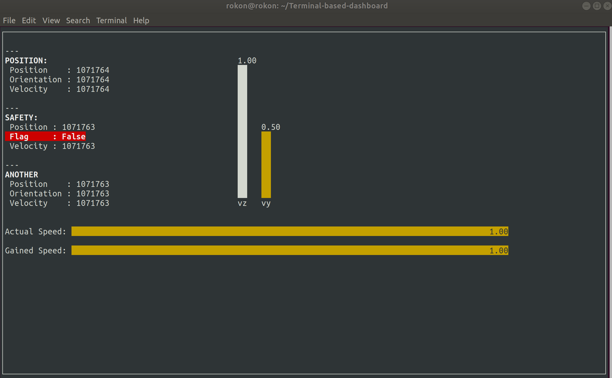

# Terminal-based dashboard
- Useful when need to observe remote operation during via ssh
- works on both linux and widows. 
- Can be resized without breaking/overlap 
- Wrapper using the curses pacakge

## How run
- Please check the test_TD.py script to run oprations. 

